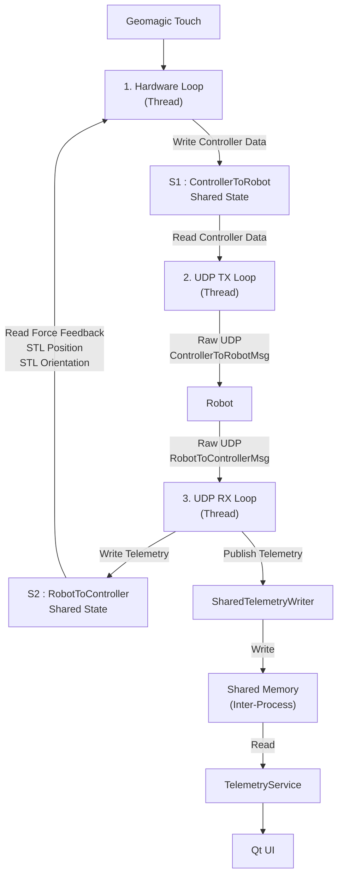

## 4. Hardware Loop

The **Hardware Loop** is responsible for direct communication with the **Geomagic Touch** device. It continuously acquires the latest controller state, applies force feedback received from the robot, and updates the **S1 (ControllerToRobot)** shared state for transmission by the UDP TX Loop.

The loop operates at approximately **1 kHz (1 ms period)** to ensure responsive teleoperation.

---

### 4.1 Workflow

```text
Start Loop
      │
      ▼
Send Watchdog
      │
      ▼
Joystick Connected?
      │
 ┌────┴────┐
 │         │
 No       Yes
 │          │
 ▼          ▼
Initialize  Check Alive
               │
               ▼
      Read Force Feedback
          From S2
               │
               ▼
      Read Joystick State
               │
               ▼
Generate ControllerToRobotMsg
               │
               ▼
 Update S1 Shared State
               │
               ▼
        Sleep (1 ms)
               │
               ▼
            Repeat
```

---

### 4.2 Watchdog Monitoring

The Hardware Loop periodically sends a watchdog message indicating the current joystick status.

```json
{
    "type": "WATCHDOG",
    "target": "UI_WATCHDOG",
    "payload":
    {
        "joystick": "on"
    }
}
```

The watchdog allows the UI to monitor the operational state of the controller.

---

### 4.3 Joystick Management

Before normal operation begins, the Hardware Loop verifies that the Geomagic Touch device is connected and initializes the device.

```cpp
if (!isJoystickPluggedIn())
{
    std::this_thread::sleep_for(
        std::chrono::seconds(1));
    continue;
}
```

```cpp
if (joystick.initialize())
{
    isJoystickConnected = true;
}
```

During operation, the loop continuously monitors the hardware connection.

```cpp
if (!joystick.isAlive())
{
    joystick.shutdown();
    isJoystickConnected = false;
}
```

If the joystick is disconnected, the Hardware Loop automatically returns to the detection stage and retries initialization.

---

### 4.4 Reading Robot Telemetry from S2

The Hardware Loop retrieves the latest telemetry written by the UDP RX Loop into **S2 (RobotToController Shared State)**.

```cpp
RobotToControllerMsg latest_force =
    shared_state.getForce();
```

The retrieved data includes:

```text
Force Feedback
STL Position
STL Orientation
```

The force feedback values are used to generate haptic feedback on the Geomagic Touch device.

---

### 4.5 Reading Controller State

The Hardware Loop continuously acquires the current state of the Geomagic Touch device.

```cpp
auto pos     = joystick.getPosition();
auto vel     = joystick.getVelocity();
auto ang_vel = joystick.getAngularVelocity();
int buttons  = joystick.getButtons();
```

The acquired controller state consists of:

```text
Position

Velocity

Angular Velocity

Button States
```

---

### 4.6 Generating the Controller Message

The acquired controller information is packed into a **ControllerToRobotMsg** structure.

```cpp
ControllerToRobotMsg msg{};
```

The message contains:

```text
Sequence Number

Position

Velocity

Angular Velocity

Button States
```

Example:

```text
Sequence Number : 150

Position
(0.12, 0.25, 0.08)

Velocity
(0.45, 0.10, 0.00)

Angular Velocity
(0.03, 0.01, 0.00)

Buttons
1
```

---

### 4.7 Updating S1 (ControllerToRobot Shared State)

Once the controller message is generated, it is written into **S1 (ControllerToRobot Shared State)**.

```cpp
shared_state.setData(msg);
```

S1 acts as the communication bridge between the **Hardware Loop** and the **UDP TX Loop**.

```text
Hardware Loop
      │
Generate ControllerToRobotMsg
      │
      ▼
S1 : ControllerToRobot
      ▲
Read ControllerToRobotMsg
      │
UDP TX Loop
```

The Hardware Loop is responsible only for producing the latest controller state. The actual network transmission is performed by the UDP TX Loop.

---

### 4.8 Recovery Mechanism

The Hardware Loop includes automatic recovery to handle hardware failures.

```text
Joystick Missing
       │
       ▼
Retry Detection
       │
       ▼
Initialize Device
       │
       ▼
Operational
```

If the joystick is disconnected during operation, the Hardware Loop safely shuts down the device, resets the connection state, and automatically retries detection and initialization without requiring the application to be restarted.


## 3.2 UDP TX Loop

The UDP TX Loop is responsible for transmitting controller data from the local teleoperation system to the robot using Raw UDP communication.

The loop runs continuously at approximately **1 kHz (1 ms period)** and sends the latest controller state generated by the Hardware Loop.

```text
Hardware Loop
      │
      ▼
 Shared State
      │
      ▼
 UDP TX Loop
      │
      ▼
   Raw UDP
      │
      ▼
    Robot
```

---

### Responsibilities

The UDP TX Loop performs the following operations:

* Read latest controller data
* Retrieve joystick position
* Retrieve joystick velocity
* Retrieve joystick angular velocity
* Retrieve button states
* Transmit ControllerToRobotMsg
* Maintain continuous robot updates

---

### Workflow

```text
Read Shared State
        │
        ▼
ControllerToRobotMsg
        │
        ▼
Send UDP Packet
        │
        ▼
Robot
        │
        ▼
Sleep 1 ms
        │
        ▼
Repeat
```

---

### Data Source

The UDP TX Loop does not communicate directly with the Geomagic Touch device.

Instead, it reads the latest controller state produced by the Hardware Loop.

```cpp
ControllerToRobotMsg msg =
    shared_state.getData();
```

Flow:

```text
Geomagic Touch
       │
       ▼
 Hardware Loop
       │
       ▼
 Shared State
       │
       ▼
 UDP TX Loop
```

This separation allows hardware access and network communication to operate independently.

---

### ControllerToRobotMsg

The transmitted packet contains the latest controller information.

```text
Sequence Number

Position
Position X
Position Y
Position Z

Velocity
Velocity X
Velocity Y
Velocity Z

Angular Velocity
Angular Velocity X
Angular Velocity Y
Angular Velocity Z

Button States
```

Example:

```text
Sequence Number : 150

Position
X : 0.12
Y : 0.45
Z : -0.03

Velocity
X : 0.50
Y : 0.10
Z : 0.00

Angular Velocity
X : 0.02
Y : 0.01
Z : 0.00

Buttons : 1
```

---

### UDP Transmission

The controller message is transmitted using a UDP socket.

```cpp
sendto(
    udp_socket,
    &msg,
    sizeof(msg),
    0,
    (const struct sockaddr*)&remote_addr,
    sizeof(remote_addr));
```

The destination is configured using:

```text
Remote IP Address
Remote UDP Port
```

Communication flow:

```text
ControllerToRobotMsg
         │
         ▼
     UDP Socket
         │
         ▼
      Network
         │
         ▼
       Robot
```

---

### Loop Timing

The UDP TX Loop operates at approximately 1 kHz.

```cpp
std::this_thread::sleep_for(
    std::chrono::milliseconds(1));
```

Loop timing:

```text
1 ms
 │
 ▼
Read Controller Data
 │
 ▼
Send UDP Packet
 │
 ▼
Repeat
```

This ensures the robot continuously receives updated controller information.

---

### Communication Flow

```text
Geomagic Touch
      │
      ▼
 Hardware Loop
      │
      ▼
 Shared State
      │
      ▼
 UDP TX Loop
      │
      ▼
 ControllerToRobotMsg
      │
      ▼
 Raw UDP
      │
      ▼
 Robot
```

The UDP TX Loop acts as the transmission layer of the Teleoperation Channel, continuously forwarding the latest controller state from the local operator to the remote robot.

## 3.3 UDP RX Loop

The UDP RX Loop is responsible for receiving telemetry data from the robot using Raw UDP communication.

The loop runs continuously and processes data sent by the robot, including force feedback and STL pose information.

```text
Robot
   │
   ▼
 Raw UDP
   │
   ▼
UDP RX Loop
   │
   ▼
Shared State
   │
   ▼
SharedTelemetryWriter
```

---

### Responsibilities

The UDP RX Loop performs the following operations:

* Receive RobotToControllerMsg packets
* Extract force feedback data
* Extract STL position data
* Extract STL orientation data
* Update shared state
* Publish telemetry to shared memory

---

### Workflow

```text
Receive UDP Packet
        │
        ▼
RobotToControllerMsg
        │
        ▼
Update Force Data
        │
        ▼
Publish Telemetry
        │
        ▼
Wait for Next Packet
```

---

### Data Source

The UDP RX Loop continuously listens for incoming UDP packets from the robot.

```cpp
recvfrom(
    udp_socket,
    &rx_msg,
    sizeof(rx_msg),
    0,
    (struct sockaddr*)&sender_addr,
    &sender_len);
```

Communication flow:

```text
Robot
   │
   ▼
Raw UDP
   │
   ▼
UDP RX Loop
```

---

### RobotToControllerMsg

The received packet contains telemetry information generated by the robot.

```text
Force Feedback
Force X
Force Y
Force Z

STL Position
Position X
Position Y
Position Z

STL Orientation
Angle X
Angle Y
Angle Z

Sequence Number
Timestamp
```

---

### Force Feedback Update

After receiving a valid packet, the latest force information is stored in the shared state.

```cpp
shared_state.setForce(rx_msg);
```

Flow:

```text
Robot Force Data
        │
        ▼
 UDP RX Loop
        │
        ▼
 Shared State
```

The Hardware Loop later retrieves this force information and applies it to the Geomagic Touch device.

```text
Robot
   │
   ▼
UDP RX Loop
   │
   ▼
Shared State
   │
   ▼
Hardware Loop
   │
   ▼
Geomagic Touch
```

---

### STL Telemetry

The robot also sends STL pose information.

```text
STL Position
X
Y
Z

STL Orientation
Roll
Pitch
Yaw
```

These values represent the latest robot-side STL position and orientation.

---

### Shared Memory Publishing

After processing the received packet, the telemetry information is written into the shared memory region.

```cpp
telemetry_writer.publish(rx_msg);
```

Published data:

```text
Force X
Force Y
Force Z

STL Position X
STL Position Y
STL Position Z

STL Orientation X
STL Orientation Y
STL Orientation Z

Sequence Number
Timestamp
```

Flow:

```text
Robot
   │
   ▼
UDP RX Loop
   │
   ▼
SharedTelemetryWriter
   │
   ▼
Shared Memory
```

---

### Data Validation

The UDP RX Loop verifies that a complete telemetry packet has been received before processing.

```cpp
if (bytes_received == sizeof(rx_msg))
{
    ...
}
```

Only complete packets are accepted for further processing.

---

### Communication Flow

```text
Robot
   │
   ▼
RobotToControllerMsg
   │
   ▼
UDP RX Loop
   │
   ├──────────────► Shared State
   │                    │
   │                    ▼
   │              Hardware Loop
   │                    │
   │                    ▼
   │              Geomagic Touch
   │
   ▼
SharedTelemetryWriter
   │
   ▼
Shared Memory
   │
   ▼
TelemetryService
   │
   ▼
Qt UI
```

The UDP RX Loop acts as the receiving layer of the Teleoperation Channel, continuously collecting robot telemetry, updating force feedback information, and publishing STL pose data for consumption by both the Hardware Loop and the Qt user interface.


