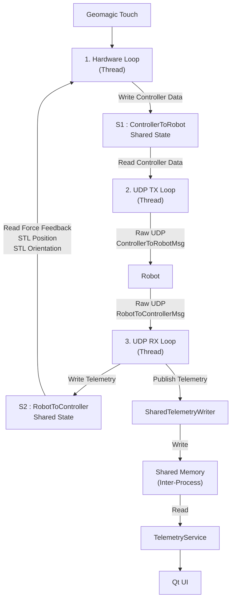

# Channel 3 - Teleoperation

# Overview

The Teleoperation Channel is responsible for real-time communication between the Geomagic Touch device and the robot using **Raw UDP** communication.

To achieve low-latency teleoperation, the channel separates hardware interaction, data transmission, and telemetry reception into independent execution threads. Communication between these threads is performed using shared state objects, while telemetry required by the Qt application is exchanged through a shared memory region.

The Teleoperation Channel consists of:

- Three parallel execution threads
- Two shared state objects for intra-process communication
- One shared memory region for inter-process communication

---



```text
                           Geomagic Touch
                                  │
                                  ▼
 ┌────────────────┬────────────────────────┬────────────────┐
 │                │                        │                │
 ▼                ▼                        ▼                ▼
UDP TX       Hardware Loop             UDP RX           Robot
 │                │                        ▲
 │                │                        │
 ▼                ▼                        │
┌─────────┐   ┌──────────────┐      ┌─────────┐
│   S1    │   │ Controller   │      │   S2    │
│Controller│   │ Processing   │      │ Robot   │
│ToRobot   │   └──────┬──────┘      │ToController
└────┬─────┘          │             └────┬─────┘
     │                │                  ▲
     └────────────────┼──────────────────┘
                      │
                      ▼
              ┌──────────────────┐
              │  Shared Memory   │
              └────────┬─────────┘
                       ▼
             ┌────────────────────┐
             │ TelemetryService   │
             └────────┬───────────┘
                      ▼
                    Qt UI
```

# Thread Communication

The Teleoperation Channel uses two shared state objects for communication between execution threads and one shared memory region for communication with the Qt application.

---

## S1 - ControllerToRobot Shared State

The **ControllerToRobot Shared State (S1)** enables communication between the **Hardware Loop** and the **UDP TX Loop**.

The Hardware Loop continuously acquires the latest controller state from the Geomagic Touch device and stores it in S1. The UDP TX Loop reads this information from S1 and transmits it to the robot using Raw UDP communication.

### Data Flow

```text
Hardware Loop
      │
Write Controller Data
      ▼
S1 : ControllerToRobot
      ▲
Read Controller Data
      │
UDP TX Loop
```

### Written By

- Hardware Loop

### Read By

- UDP TX Loop

### Stored Data

```text
Sequence Number

Position

Velocity

Angular Velocity

Button States
```

---

## S2 - RobotToController Shared State

The **RobotToController Shared State (S2)** enables communication between the **UDP RX Loop** and the **Hardware Loop**.

The UDP RX Loop continuously receives robot telemetry and stores it in S2. The Hardware Loop reads this information to obtain the latest force feedback and STL pose information.

### Data Flow

```text
Robot
      │
RobotToControllerMsg
      ▼
UDP RX Loop
      │
Write Robot Telemetry
      ▼
S2 : RobotToController
      ▲
Read Force Feedback
Read STL Position
Read STL Orientation
      │
Hardware Loop
```

### Written By

- UDP RX Loop

### Read By

- Hardware Loop

### Stored Data

```text
Force Feedback

STL Position

STL Orientation

Sequence Number
```

---

## Shared Memory

The Qt application executes in a separate process and therefore cannot directly access **S1** or **S2**.

To enable inter-process communication, the UDP RX Loop publishes the latest robot telemetry into a shared memory region using the **SharedTelemetryWriter**. The Qt application's **TelemetryService** continuously reads this shared memory and provides the telemetry to the user interface.

### Data Flow

```text
UDP RX Loop
      │
      ▼
SharedTelemetryWriter
      │
Write Shared Memory
      ▼
Shared Memory
      ▲
Read Shared Memory
      │
TelemetryService
      │
      ▼
Qt UI
```

### Written By

- SharedTelemetryWriter (invoked by the UDP RX Loop)

### Read By

- TelemetryService

### Published Data

```text
Force Feedback

STL Position

STL Orientation

Sequence Number

Timestamp
```

---

# Thread 1 - Hardware Loop

The **Hardware Loop** is responsible for direct communication with the **Geomagic Touch** device.

It continuously:

- Monitors the joystick connection.
- Applies force feedback received from **S2 (RobotToController Shared State)**.
- Reads the latest controller state from the Geomagic Touch device.
- Generates a **ControllerToRobotMsg**.
- Updates **S1 (ControllerToRobot Shared State)** for the UDP TX Loop.

The Hardware Loop operates at approximately **1 kHz (1 ms period)**.

---

## 1.1 Workflow

```text
Start Loop
      │
      ▼
Send Watchdog
      │
      ▼
Joystick Connected?
      │
 ┌────┴────┐
 │         │
 No       Yes
 │          │
 ▼          ▼
Initialize  Check Alive
               │
               ▼
      Read Force Feedback
          From S2
               │
               ▼
      Read Joystick State
               │
               ▼
Generate ControllerToRobotMsg
               │
               ▼
 Update S1 Shared State
               │
               ▼
        Sleep (1 ms)
               │
               ▼
            Repeat
```

---

## 1.2 Watchdog Monitoring

The Hardware Loop periodically sends a watchdog message indicating the current joystick status.

```json
{
    "type": "WATCHDOG",
    "target": "UI_WATCHDOG",
    "payload":
    {
        "joystick": "on"
    }
}
```

This allows the UI to continuously monitor the operational state of the Geomagic Touch device.

---

## 1.3 Joystick Management

Before normal operation begins, the Hardware Loop verifies that the Geomagic Touch device is connected and initializes the hardware.

### Joystick Detection

```cpp
if (!isJoystickPluggedIn())
{
    std::this_thread::sleep_for(
        std::chrono::seconds(1));
    continue;
}
```

### Joystick Initialization

```cpp
if (joystick.initialize())
{
    isJoystickConnected = true;
}
```

### Hot-Unplug Detection

```cpp
if (!joystick.isAlive())
{
    joystick.shutdown();
    isJoystickConnected = false;
}
```

If the joystick is disconnected during operation, the Hardware Loop automatically returns to the detection stage and retries initialization.

---

## 1.4 Reading Robot Telemetry from S2

The Hardware Loop retrieves the latest telemetry written by the UDP RX Loop into **S2 (RobotToController Shared State)**.

```cpp
RobotToControllerMsg latest_force =
    shared_state.getForce();
```

The retrieved telemetry includes:

```text
Force Feedback

STL Position

STL Orientation
```

The force feedback values are applied to the Geomagic Touch device to generate haptic feedback.

---

## 1.5 Reading Controller State

The Hardware Loop continuously acquires the current controller state.

```cpp
auto pos     = joystick.getPosition();
auto vel     = joystick.getVelocity();
auto ang_vel = joystick.getAngularVelocity();
int buttons  = joystick.getButtons();
```

The acquired controller state consists of:

```text
Position

Velocity

Angular Velocity

Button States
```

---

## 1.6 Generating ControllerToRobot Message

The acquired controller information is packed into a **ControllerToRobotMsg** structure.

```cpp
ControllerToRobotMsg msg{};
```

The generated message contains:

```text
Sequence Number

Position

Velocity

Angular Velocity

Button States
```

---

## 1.7 Updating S1 (ControllerToRobot Shared State)

The generated controller message is written into **S1 (ControllerToRobot Shared State)**.

```cpp
shared_state.setData(msg);
```

S1 acts as the communication bridge between the Hardware Loop and the UDP TX Loop.

```text
Hardware Loop
      │
Generate ControllerToRobotMsg
      │
      ▼
S1 : ControllerToRobot
      ▲
Read ControllerToRobotMsg
      │
UDP TX Loop
```

The Hardware Loop only updates S1. The UDP TX Loop retrieves the latest controller data from S1 and transmits it to the robot.

---

## 1.8 Recovery Mechanism

The Hardware Loop includes automatic recovery to handle hardware failures.

```text
Joystick Missing
       │
       ▼
Retry Detection
       │
       ▼
Initialize Device
       │
       ▼
Operational
```

If the joystick is disconnected during operation, the Hardware Loop safely shuts down the device, resets the connection state, and automatically retries detection and initialization without requiring the application to be restarted.

# Thread 2 - UDP TX Loop

The **UDP TX Loop** is responsible for transmitting the latest controller data from **S1 (ControllerToRobot Shared State)** to the robot using **Raw UDP** communication.

Unlike the Hardware Loop, the UDP TX Loop does not interact with the Geomagic Touch device. It simply retrieves the latest **ControllerToRobotMsg** from S1 and continuously transmits it to the robot at approximately **1 kHz (1 ms period)**.

---

## 2.1 Workflow

```text
Read ControllerToRobotMsg
        From S1
          │
          ▼
Retrieve Latest Controller Data
          │
          ▼
Send UDP Packet
          │
          ▼
        Robot
          │
          ▼
     Sleep (1 ms)
          │
          ▼
        Repeat
```

---

## 2.2 Reading Controller Data from S1

The UDP TX Loop retrieves the latest controller information written by the Hardware Loop into **S1 (ControllerToRobot Shared State)**.

```cpp
ControllerToRobotMsg msg =
    shared_state.getData();
```

### Data Flow

```text
Hardware Loop
      │
Generate ControllerToRobotMsg
      │
      ▼
S1 : ControllerToRobot
      ▲
Read ControllerToRobotMsg
      │
UDP TX Loop
```

The UDP TX Loop always transmits the most recent controller state available in S1.

---

## 2.3 ControllerToRobot Message

The transmitted **ControllerToRobotMsg** contains the latest controller information.

```text
Sequence Number

Position

Velocity

Angular Velocity

Button States
```

Example:

```text
Sequence Number : 150

Position
(0.12, 0.45, -0.03)

Velocity
(0.50, 0.10, 0.00)

Angular Velocity
(0.02, 0.01, 0.00)

Buttons
1
```

---

## 2.4 UDP Transmission

The controller message is transmitted to the robot using a UDP socket.

```cpp
sendto(
    udp_socket,
    &msg,
    sizeof(msg),
    0,
    (const struct sockaddr*)&remote_addr,
    sizeof(remote_addr));
```

### Communication Flow

```text
ControllerToRobotMsg
          │
          ▼
      UDP Socket
          │
          ▼
       Raw UDP
          │
          ▼
        Robot
```

The destination IP address and UDP port are configured during service initialization.

---

## 2.5 Loop Timing

The UDP TX Loop executes continuously at approximately **1 kHz**.

```cpp
std::this_thread::sleep_for(
    std::chrono::milliseconds(1));
```

This ensures the robot continuously receives the latest controller state generated by the Hardware Loop.

# Thread 3 - UDP RX Loop

The **UDP RX Loop** is responsible for receiving robot telemetry through **Raw UDP** communication.

It continuously receives the latest **RobotToControllerMsg** from the robot, updates **S2 (RobotToController Shared State)** with the received telemetry, and publishes the latest telemetry to **Shared Memory** for use by the Qt application.

The UDP RX Loop runs continuously to ensure the latest robot state is available to both the Hardware Loop and the Qt user interface.

---

## 3.1 Workflow

```text
Receive UDP Packet
        │
        ▼
RobotToControllerMsg
        │
        ▼
Update S2
        │
        ├──────────────► Hardware Loop
        │
        ▼
Publish Shared Memory
        │
        ▼
TelemetryService
        │
        ▼
Qt UI
        │
        ▼
Wait for Next Packet
```

---

## 3.2 Receiving Robot Telemetry

The UDP RX Loop continuously listens for incoming telemetry packets from the robot.

```cpp
recvfrom(
    udp_socket,
    &rx_msg,
    sizeof(rx_msg),
    0,
    (struct sockaddr*)&sender_addr,
    &sender_len);
```

### Communication Flow

```text
Robot
    │
Raw UDP
    │
    ▼
UDP RX Loop
```

---

## 3.3 RobotToController Message

Each received **RobotToControllerMsg** contains the latest robot telemetry.

```text
Force Feedback

STL Position

STL Orientation

Sequence Number

Timestamp
```

---

## 3.4 Updating S2 (RobotToController Shared State)

After receiving a valid packet, the latest telemetry is written into **S2 (RobotToController Shared State)**.

```cpp
shared_state.setForce(rx_msg);
```

### Data Flow

```text
Robot
    │
RobotToControllerMsg
    │
    ▼
UDP RX Loop
    │
Write Robot Telemetry
    ▼
S2 : RobotToController
    ▲
Read Force Feedback
Read STL Position
Read STL Orientation
    │
Hardware Loop
```

The Hardware Loop continuously retrieves the latest telemetry from S2 to generate force feedback and obtain the current STL pose.

---

## 3.5 Publishing Telemetry to Shared Memory

The UDP RX Loop also publishes the received telemetry to **Shared Memory** using the **SharedTelemetryWriter**.

```cpp
telemetry_writer.publish(rx_msg);
```

The published telemetry includes:

```text
Force Feedback

STL Position

STL Orientation

Sequence Number

Timestamp
```

### Data Flow

```text
UDP RX Loop
      │
      ▼
SharedTelemetryWriter
      │
Write Shared Memory
      ▼
Shared Memory
      ▲
Read Shared Memory
      │
TelemetryService
      │
      ▼
Qt UI
```

This enables the Qt application to access the latest robot telemetry without directly interacting with the Teleoperation Service.

---

## 3.6 Packet Validation

The UDP RX Loop verifies that a complete telemetry packet has been received before processing.

```cpp
if (bytes_received == sizeof(rx_msg))
{
    ...
}
```

Only complete packets are accepted for further processing.

---

## 3.7 Communication Summary

```text
                 Robot
                   │
          RobotToControllerMsg
                   │
                   ▼
             UDP RX Loop
              │         │
              │         │
              ▼         ▼
             S2    SharedTelemetryWriter
              │         │
              ▼         ▼
      Hardware Loop  Shared Memory
                        │
                        ▼
                TelemetryService
                        │
                        ▼
                      Qt UI
```

The UDP RX Loop acts as the receiving layer of the Teleoperation Channel by receiving robot telemetry, updating **S2** for the Hardware Loop, and publishing telemetry to **Shared Memory** for the Qt application.


